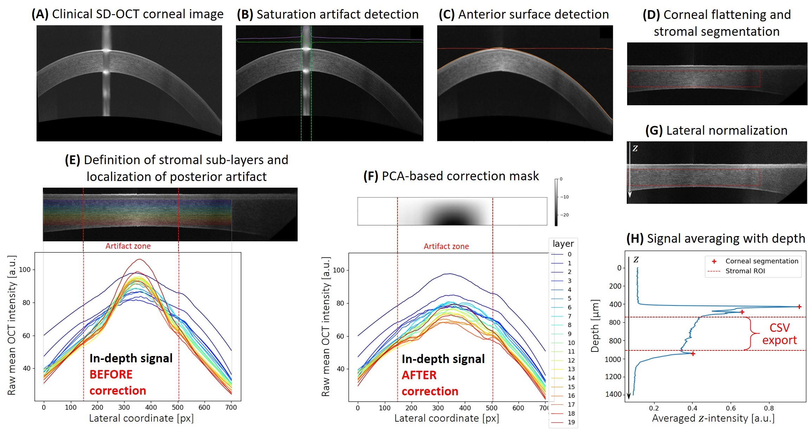

# FitOCT-preprocessing
Standardize raw corneal images from a widespread clinical SD-OCT device (RTVue-XR Avanti OCT; Optovue Inc., Fremont, CA, USA) and extract the in-depth attenuation profile from the corneal stroma while compensating for acquisition artifacts.

The output CSV file can be analyzed in terms of Birge ratio and photon mean-free path thanks to Pascal Pernot's FitOCT bayesian procedure, that fits OCT decays using R/stan (2019). The code is available here: https://doi.org/10.5281/zenodo.2579915

The FitOCT pre-processing procedure includes contributions from Romain Bocheux and Bathilde Rivière.

=> *The method is currently under publication process. The code, private for now, will be made available for reproducibility purposes.
You can find a preprint version of the paper here:* https://arxiv.org/abs/2112.00528

## Automated SD-OCT image processing steps

<figure>

<figcaption align = "center"><b><i>Figure 2. Graphical representation of the pre-processing algorithm with individual steps for SD-OCT corneal image standardization and stromal in-depth intensity profile extraction.</b> (A) Ouput image of the SD-OCT clinical device (‘Line’ scan mode). (B) Saturation artifact detection after histogram sliding to adjust exposure. (C) Detection of anterior surface. (D) Numerical flattening of the cornea and segmentation of the apex-centered stromal region of interest (ROI). (E, F) Computation of a customized correction mask to account for the posterior stromal artifact. (G) Lateral normalization of the flattened and corrected image. (H) Extraction of the stromal in-depth intensity profile.
</i></figcaption>
</figure>

   **(A) Clinical OCT image import and optional exposure restoration.** If the imported image is overexposed (mean histogram value is higher than a given threshold), a standard exposure is restored thanks to a custom histogram sliding. The signal-to-noise ratio of the image is computed.
   
   **(B) Detection and optional removal of the saturation artifact.** The key feature here is the relatively high intensity of the few neighboring columns in the artifact zone. The signal level of each column (A-scan) is averaged to get the mean A-scan intensity as a function of the lateral (x-) coordinate. This signal is smoothened (2nd order Savitzky-Golay filter, 15-pixel window to remove discontinuities) and its first derivative is computed. If the absolute value of this derivative reveals an abrupt change in lateral (x-) intensity, the presence of a prominent central artifact is confirmed. In that case, the lateral boundaries of the artifact are set at the x-coordinates corresponding to the two extreme values of the derivative (maximum derivative value for the left boundary, minimum value for the right) ± a 55-µm margin. The OCT image is then cropped according to those boundaries. User consent is required; if denied, a cursor enables manual (x-) segmentation of this artifact.
   
   **(C) Detection of anterior surface.** For each column of the smoothened image (Gaussian filter, σ=2), the local maximum corresponding to the depth (z-) coordinate of the air-tear film interface is determined based on an SNR-dependent thresholding procedure. In case of detection error at the edges of the image, the anterior surface is linearly interpolated and subsequently smoothened (median filter, 15-pixel window).
   
   **(D) Flattening of the cornea and stromal segmentation.** Each column of the exposure-adjusted image is axially translated so that all anterior surface z-coordinates (located in step C) horizontally match. Compared to a flattening following the refracted ray path, the translation option leads to a maximal +0.6% distortion of the in-depth distance (at the edges of the ROI, ± 3 mm from the corneal apex) which we find acceptable. Each line of the flattened cornea is then averaged, to get the mean in-depth OCT signal. The three main peaks of this signal are detected, which correspond to the z-coordinates of the following interfaces: air-tear, epithelium-epithelial basement membrane/Bowman’s layer, and endothelium-aqueous. **The region of interest (ROI) delineates stromal boundaries**; it is determined for an apex-centered 6-mm-wide lateral area (x-axis) and lies between the epithelial basement membrane (EBM) and the endothelium (z-axis). The ROI excludes two axial (z-) margins: a 50-µm margin after the epithelium-EBM/Bowman’s layer interface as well as a 30-µm margin before the endothelium-aqueous interface, to assure exclusion of both Bowman’s and Descemet’s layers contribution, respectively. The (z-) margins were chosen empirically based on values known from corneal histology that were further adjusted to optimize the repeatability of our transparency measures for normal corneas (see below). User consent is required; if denied, a cursor enables manual segmentation of the stromal ROI.
   
   **(E) Lateral localization of the posterior stromal artifact.** The segmented stromal ROI is numerically divided into 20 sub-layers of a constant thickness (see Figure 2E, top) and color-coded according to depth (i.e., the warmer the color, the deeper the sub-layer). The mean lateral (x-) OCT intensity of each sub-layer is then computed, as illustrated in Figure 2E, bottom (using the same color-coding as in Figure 2E, top). The individual values are stored in a matrix and a principal component analysis (PCA) is performed (the associated eigenvectors can indeed depict data tendencies and discrepancies; see Supplementary Methods for more details), using Python’s `sklearn.decomposition.PCA` function from the Scikit-learn Matrix Decomposition module (version 0.21.3); the lateral (x-) coordinates of the artifact zone are located from the standard deviation of the 2nd principal component eigenvalues (as indicated by the dashed red lines in Figure 2E).
   
   **(F) Computation and application of a customized correction mask to compensate for the posterior stromal artifact.** A second PCA is performed on the same input data in the artifact zone (i.e., the specifically located x-coordinate range); the intensity corresponding to a customized correction mask for the posterior stromal artifact is derived from the 1st principal component eigenvalues of this second PCA (see Figure 2F, top). Upon application of the mask, one can observe in Figure 2F, bottom, that the intensities of the deepest sub-layers have been numerically attenuated (in comparison to Figure 2E, bottom).
   
   **(G) Normalization of the image to compensate for the peripheral loss of intensity due to the geometry of the corneal curvature.** The normalization vector used is the smoothed intensity signal at the anterior surface (2nd order Savitzky-Golay filtering, 115-pixel window). Every value below 75 on an 8-bit grayscale is set equal to 75, to avoid overemphasizing the contribution of edges.
   
   **(H) Averaging of the final image into a single averaged A-scan to extract the mean OCT intensity as a function of depth.** This stromal in-depth attenuation profile is exported as a CSV file.
   
